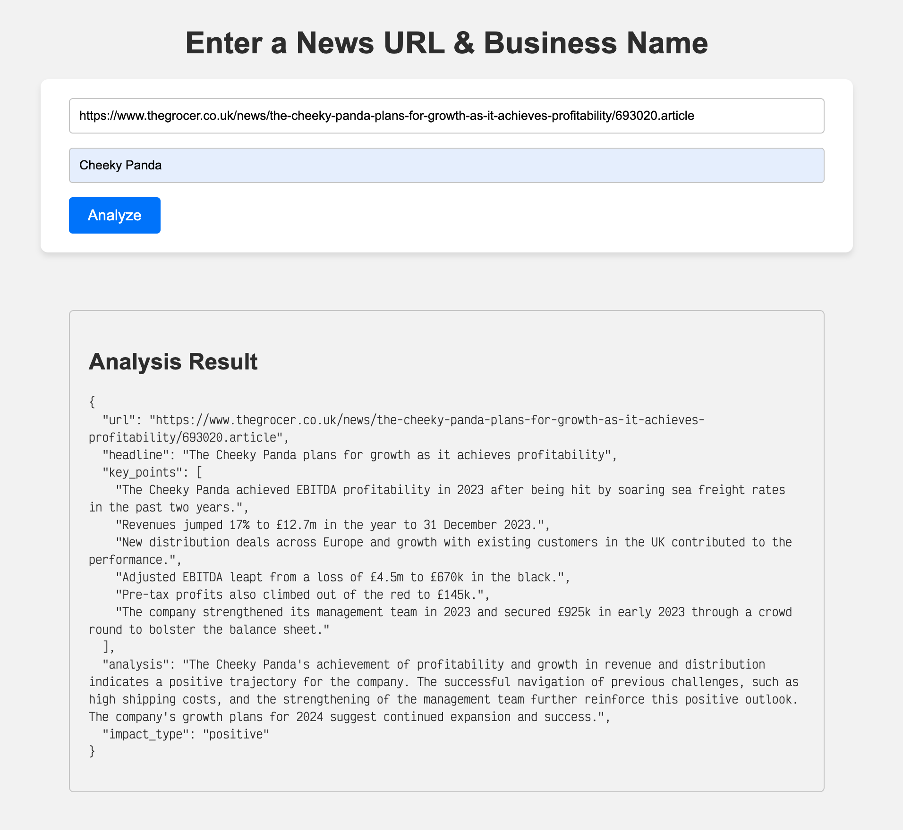

## Setup Instructions

1. Create and activate a virtual environment:
   ```bash
   python -m venv env
   source env/bin/activate  # On Windows use `env\Scripts\activate`
   ```

2. Install dependencies:
   ```bash
   pip install -r requirements.txt
   ```

3. Create a `.env` file at the root with your Google API key:
   ```
   GOOGLE_API_KEY=your_api_key_here
   ```

4. Start the webserver:
   ```bash
   python app.py
   ```

5. Open your browser and navigate to [http://127.0.0.1:5000/](http://127.0.0.1:5000/) to use the application.


## UI Screenshot


